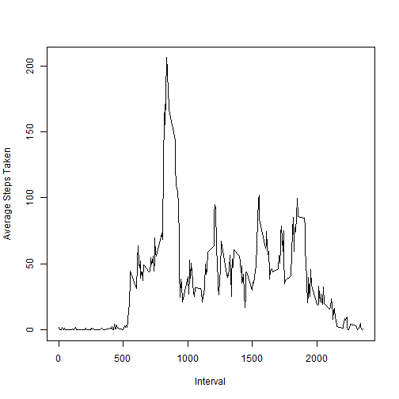
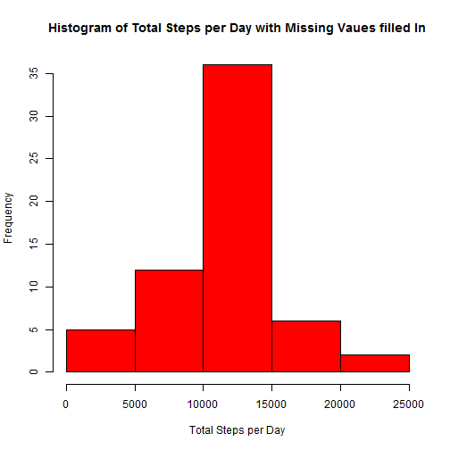
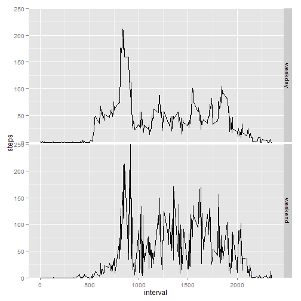

# Reproducible Research: Peer Assessment 1


## Loading and preprocessing the data

```r
theData <- read.csv(file="activity.csv", na.strings="NA")
theData$date <- as.Date(theData$date, format="%Y-%m-%d")
```

## What is mean total number of steps taken per day?

```r
totalStepsPerDay <- aggregate(theData$steps, by = list(theData$date), FUN=sum)
colnames(totalStepsPerDay) <- c("date", "totalSteps")

# Histogram of total steps per day
hist(totalStepsPerDay[,2], main = "Histogram of Total Steps per Day", 
     xlab="Total Steps per Day", col="red")
```

 

```r
# mean total number of steps taken per day ignoring missing values
mean(  totalStepsPerDay[, 2], na.rm=TRUE ) 
```

```
## [1] 10766
```

```r
# median total number of steps taken per day ignoring missing values
median( totalStepsPerDay[,2], na.rm=TRUE )
```

```
## [1] 10765
```

## What is the average daily activity pattern?

```r
#intervalByAvgSteps <- sqldf("select interval, avg(steps) from theData group by interval")
intervalByAvgSteps <- aggregate(steps ~ interval, data = theData, FUN=mean)
colnames(intervalByAvgSteps)  <- c("interval", "avgSteps")

# time series plot of the average number of steps taken (averaged across all days) 
#   versus the 5-minute intervals    
plot(x=intervalByAvgSteps$interval, y=intervalByAvgSteps$avgSteps, type="l", xlab="Interval", 
     ylab="Average Steps Taken")
```

 

```r
# The 5-minute interval, on average across all the days in the dataset, 
#   that contains the maximum number of steps
(intervalByAvgSteps[order(intervalByAvgSteps$avgSteps), ])[nrow(intervalByAvgSteps), 1]
```

```
## [1] 835
```

## Imputing missing values

```r
#sum( sapply(theData, function(x) sum(is.na(x))) )


# replace the missing values with the average number of steps across 
#   the dates for the interval

# copy the data to a new data frame object.
theDataWithoutNA <- data.frame(theData)
for (i in 1:nrow(theDataWithoutNA)) {
    if (is.na(theData[i, 1]) == TRUE) {
        
        currentInterval <- theDataWithoutNA[i, 3]

        theDataWithoutNA[i, 1] <- as.integer(
            intervalByAvgSteps[intervalByAvgSteps$interval==currentInterval, 2]
            )
        
    }
}
# create a histogram of total steps per day with missing vaues filled in.
totalStepsPerDayWithoutNA <- aggregate(theDataWithoutNA$steps, 
                                   by = list(theDataWithoutNA$date), FUN=sum)
colnames(totalStepsPerDayWithoutNA) <- c("date", "totalSteps")
hist(totalStepsPerDayWithoutNA[,2], main = "Histogram of Total Steps per Day with Missing Vaues filled In", 
     xlab="Total Steps per Day", col="red")
```

 

```r
# mean total number of steps taken per day after the missing values have been filled in
mean(   totalStepsPerDayWithoutNA[, 2], na.rm=TRUE ) 
```

```
## [1] 10750
```

```r
# median total number of steps taken per day after the missing values have been filled in
median( totalStepsPerDayWithoutNA[,2], na.rm=TRUE )
```

```
## [1] 10641
```

## Are there differences in activity patterns between weekdays and weekends?

```r
theDataWithoutNA$weekday <- factor(weekdays(theDataWithoutNA$date)==c("Sunday", "Saturday") , 
                                      labels=c("weekday", "weekend") )
# print(theDataWithoutNA[2,])
# print(theDataWithoutNA[1745,])
intervalByAvgSteps <- aggregate(steps ~ interval + weekday, data = theDataWithoutNA, FUN=mean)
intervalByAvgSteps$steps <- as.integer( intervalByAvgSteps$steps )

library(ggplot2)
```

```
## Warning: package 'ggplot2' was built under R version 3.1.1
```

```r
# panel plot comparing the average number of steps taken per 5-minute interval, top panel is weekdays,
#   bottom panel is weekends.
g <- ggplot(intervalByAvgSteps, aes(interval, steps))
g + facet_grid(weekday ~ . )     + geom_line() + coord_cartesian(ylim = c(0, 250)) 
```

 


