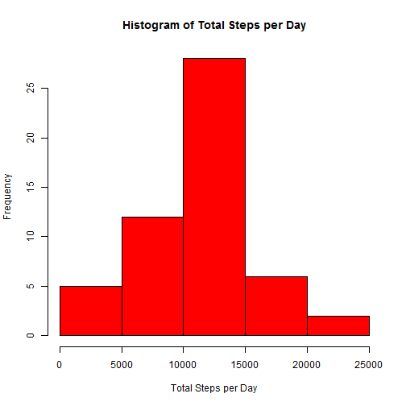
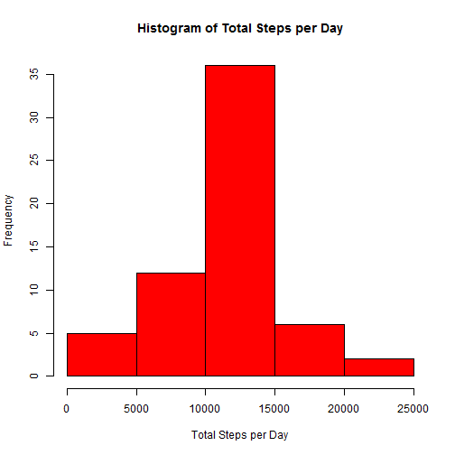

# Reproducible Research: Peer Assessment 1


## Loading and preprocessing the data

```r
theData <- read.csv(file="activity.csv", na.strings="NA")
theData$date <- as.Date(theData$date, format="%Y-%m-%d")
```

## What is mean total number of steps taken per day?

```r
totalStepsPerDay <- aggregate(theData$steps, by = list(theData$date), FUN=sum)
colnames(totalStepsPerDay) <- c("date", "totalSteps")

hist(totalStepsPerDay[,2], main = "Histogram of Total Steps per Day", 
     xlab="Total Steps per Day", col="red")
```

 

```r
mean(  totalStepsPerDay[, 2], na.rm=TRUE ) 
```

```
## [1] 10766
```

```r
median( totalStepsPerDay[,2], na.rm=TRUE )
```

```
## [1] 10765
```

## What is the average daily activity pattern?

```r
#intervalByAvgSteps <- sqldf("select interval, avg(steps) from theData group by interval")
intervalByAvgSteps <- aggregate(steps ~ interval, data = theData, FUN=mean)
colnames(intervalByAvgSteps)  <- c("interval", "avgSteps")
    
plot(x=intervalByAvgSteps$interval, y=intervalByAvgSteps$avgSteps, type="l", xlab="Interval", 
     ylab="Average Steps Taken")
```

 

```r
# The 5-minute interval, on average across all the days in the dataset, 
#   contains the maximum    number of steps
(intervalByAvgSteps[order(intervalByAvgSteps$avgSteps), ])[nrow(intervalByAvgSteps), 1]
```

```
## [1] 835
```

## Imputing missing values

```r
sum( sapply(theData, function(x) sum(is.na(x))) )
```

```
## [1] 2304
```

```r
theDataWithoutNA <- data.frame(theData)
# replace NAs in the number of steps column
for (i in 1:nrow(theDataWithoutNA)) {
    if (is.na(theData[i, 1]) == TRUE) {
        
        currentInterval <- theDataWithoutNA[i, 3]
        theDataWithoutNA[i, 1] <- as.integer(
            intervalByAvgSteps[intervalByAvgSteps$interval==currentInterval, 2]
            )
        
    }
}

totalStepsPerDayWithoutNA <- aggregate(theDataWithoutNA$steps, 
                                       by = list(theDataWithoutNA$date), FUN=sum)
colnames(totalStepsPerDayWithoutNA) <- c("date", "totalSteps")

hist(totalStepsPerDayWithoutNA[,2], main = "Histogram of Total Steps per Day", 
     xlab="Total Steps per Day", col="red")
```

 

```r
mean(   totalStepsPerDayWithoutNA[, 2], na.rm=TRUE ) 
```

```
## [1] 10750
```

```r
median( totalStepsPerDayWithoutNA[,2], na.rm=TRUE )
```

```
## [1] 10641
```

## Are there differences in activity patterns between weekdays and weekends?

```r
theDataWithoutNA$weekday <- factor(weekdays(theDataWithoutNA$date)==c("Sunday", "Saturday") , 
                                      labels=c("weekday", "weekend") )
# print(theDataWithoutNA[2,])
# print(theDataWithoutNA[1745,])
intervalByAvgSteps <- aggregate(steps ~ interval + weekday, data = theDataWithoutNA, FUN=mean)
intervalByAvgSteps$steps <- as.integer( intervalByAvgSteps$steps )

library(ggplot2)
```

```
## Warning: package 'ggplot2' was built under R version 3.1.1
```

```r
g <- ggplot(intervalByAvgSteps, aes(interval, steps))
g + facet_grid(weekday ~ . )     + geom_line() + coord_cartesian(ylim = c(0, 250)) 
```

 


